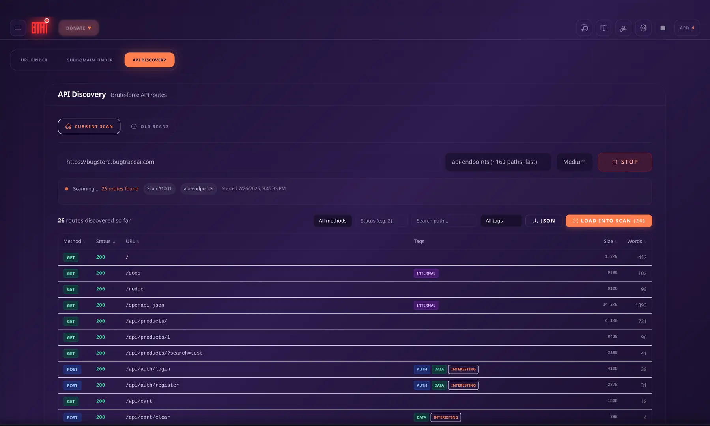
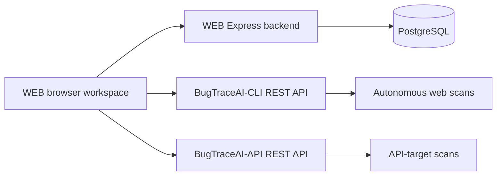

<p align="center">
  <a href="https://github.com/BugTraceAI/BugTraceAI">
    
  </a>
</p>

<h1 align="center">BugTraceAI-WEB</h1>

<p align="center">
  Launch scans. Follow agents live. Investigate requests. Review the evidence.
</p>

<p align="center">
  <a href="https://bugtraceai.com"></a>
  <a href="https://bugtraceai.github.io/BugTraceAI/bugtraceai-web/"></a>
  <a href="https://deepwiki.com/BugTraceAI/BugTraceAI-WEB"></a>
  <a href="https://discord.gg/g48NcdGme"></a>
  <a href="https://github.com/BugTraceAI/BugTraceAI-WEB/tree/v2.0.32-beta"></a>
  <a href="LICENSE"></a>
</p>

<p align="center">
  <a href="#quick-start"></a>
  <a href="https://demo.bugtraceai.com/bugtraceai"></a>
  <a href="https://github.com/BugTraceAI/BugTraceAI"></a>
</p>

BugTraceAI-WEB is the self-hosted browser workspace for the
[BugTraceAI](https://github.com/BugTraceAI/BugTraceAI) security suite. Use its
analysis tools independently, connect **BugTraceAI-CLI** for autonomous web
scans, or connect **BugTraceAI-API** for API-target testing.

[Quick start](#quick-start) · [Workspace](#workspace) · [Screenshots](#screenshots) · [Engine connections](#engine-connections) · [Development](#development) · [Documentation](#documentation)

## See it in action

<p align="center">
  <a href="https://www.youtube.com/watch?v=FCoQNgO8hmM">
    
  </a>
</p>

<p align="center">
  <a href="https://www.youtube.com/watch?v=FCoQNgO8hmM">Watch the product walkthrough on YouTube</a>
</p>

## Quick start

Run the official [BugTraceAI Launcher](https://github.com/BugTraceAI/BugTraceAI-Launcher):

```bash
curl -fsSL https://raw.githubusercontent.com/BugTraceAI/BugTraceAI-Launcher/main/install.sh | bash
```

The Launcher presents provider setup, installation choices, module selection,
and ports before deploying the selected services.

- **WEB only:** choose Wizard and select WEB for the dashboard and analysis tools. Existing scanning engines can be connected later.
- **WEB + scanning engines:** select WEB with CLI, BugTraceAI-API, or both for the scan workflows you need.
- **Full workspace:** include the CLI terminal TUI alongside WEB and the selected engines.

WEB deployment uses Docker. Optional Kali and reconFTW toolboxes can be selected
during setup. Review the installation plan, then open the WEB URL printed by
the Launcher; the usual frontend port is **6869**, but your configured port
takes precedence.

From an existing WEB checkout, `./install.sh` opens the same Launcher with WEB
suggested. Direct standalone Docker setup and a copyable coding-agent prompt
are in [INSTALLATION.md](INSTALLATION.md#option-2-standalone-docker).

### Configure your workspace

In **Settings**, choose **OpenRouter**, **Anthropic**, or **Z.ai**, enter that
provider's key locally, and select a model. **ModelLab** uses its own OpenRouter
key inside the module, independently of the provider used for analysis.

For target login, use the scan launcher's **Auth Config** tab. Login YAML and
optional TOTP/2FA are documented in the
[authentication guide](INSTALLATION.md#authenticated-scanning-yaml--totp).

For Launcher-managed deployments, run `./launcher.sh status`, `logs web`, `start`, `stop`, or
`update --plan` from the Launcher checkout. See its
[command guide](https://github.com/BugTraceAI/BugTraceAI-Launcher#commands).

## Workspace

| Area | What you can do |
| --- | --- |
| **Web scans** | Launch CLI scans, configure target authentication, follow the six scan phases and live Swarm Graph, resume recoverable scans, and review reports. |
| **API testing** | Connect the standalone BugTraceAI-API engine to launch API audits, follow progress, inspect findings and evidence, and download reports. |
| **AIrepeater** | Inspect HTTP requests and responses in a Request / Response / AI Agent workbench. Send requests manually or with AI assistance, use vulnerability playbooks, and hand findings into reports. |
| **Analysis tools** | Work with URL and source-code analysis, security headers, DOM XSS, JWT auditing, file uploads, and privilege-escalation research. |
| **Discovery and payloads** | Discover subdomains, historical URLs, JavaScript endpoints, and API routes. Prepare WAF-bypass and SSTI payloads or out-of-band interaction checks. |
| **AI assistants** | Investigate security questions in chat and connect optional Kali and reconFTW MCP toolboxes. |
| **ModelLab** | Compare OpenRouter models with live benchmark progress, per-slot recommendations, cost visibility, results, and run history. |
| **Reports** | Inspect severity, validation state, evidence, and PoCs; compare reports, search analysis history, and export results. |

The scanning engines are independent products. WEB's own chat, settings, and
analysis tools remain available without connecting either engine; engine-specific
scan workflows require the corresponding service.

## Screenshots

| Live scan workspace | Specialist Swarm Graph |
| :---: | :---: |
| [](assets/console.webp) | [](assets/swarm-graph.webp) |
| **API route discovery** | **Findings and report explorer** |
| [](assets/api-discovery.webp) | [](assets/report-findings.webp) |

These example captures use the BugStore practice target. Counts and findings
belong to those sessions. The sample report linked above was generated with an
earlier scanner build and is provided to explore the workflow.

## Engine connections



| Service | Role |
| --- | --- |
| **WEB backend + PostgreSQL** | Store this WEB instance's chats, settings, and analysis history. |
| [**BugTraceAI-CLI**](https://github.com/BugTraceAI/BugTraceAI-CLI) | Run autonomous web scans and provide scan events, configuration, findings, and reports. |
| [**BugTraceAI-API**](https://github.com/BugTraceAI/BugTraceAI-API) | Run independent API-target audits over REST, with MCP available for external assistants. |

The Launcher configures connections for the engines you select. For an existing
or remote service, use the **CLI API URL** or **BugTraceAI-API URL** fields in
Settings and the corresponding **Test** button.

Docker deployments use same-origin proxy routes (`/cli-api` and `/btai-api`).
The usual direct REST ports are **8000** for CLI and **8005** for BugTraceAI-API;
use the actual URLs from your deployment. Multiple WEB instances can connect
to the same CLI service. WEB and the scanning services are intended for a local
machine or trusted network.

## Development

Local development requires Node/npm and a configured PostgreSQL database.
Follow the [development setup](INSTALLATION.md#option-4-local-development-setup)
for environment variables and database credentials.

Backend terminal:

```bash
cd backend
npm install
# Configure backend/.env for your local PostgreSQL database.
npx prisma migrate dev
npm run dev
```

Frontend terminal, from the WEB repository root:

```bash
npm install
# Configure the frontend environment as described in INSTALLATION.md.
npm run dev
```

The backend defaults to **3001** and Vite to **5173**.
Run `npm run build` for the production frontend build.

| Layer | Technology |
| --- | --- |
| Frontend | React 18, TypeScript, Vite, Tailwind CSS |
| Backend and storage | Express 5, Prisma, PostgreSQL 16 |
| Live events and visualization | Socket.IO, Recharts |
| HTTP and code workbench | Monaco Editor |
| Deployment | Docker Compose, Nginx |

## Documentation

| Guide | Contents |
| --- | --- |
| [Installation](INSTALLATION.md) | Guided setup, standalone Docker, coding-agent prompts, configuration, and troubleshooting |
| [Authentication](INSTALLATION.md#authenticated-scanning-yaml--totp) | Target login YAML and TOTP/2FA |
| [Launcher](https://github.com/BugTraceAI/BugTraceAI-Launcher) | Module selection, provider setup, service management, and updates |
| [WEB documentation](https://bugtraceai.github.io/BugTraceAI/bugtraceai-web/) | Workspace and tool documentation |
| [Changelog](CHANGELOG.md) · [Tags](https://github.com/BugTraceAI/BugTraceAI-WEB/tags) · [Releases](https://github.com/BugTraceAI/BugTraceAI-WEB/releases) | Version history and published builds |
| [BugStore](https://github.com/BugTraceAI/BugStore) | Deliberately vulnerable practice target |

## Responsible use and license

Use BugTraceAI only for educational work and testing you are authorized to
perform. AI findings can be wrong; verify the evidence before relying on them.

Licensed under **Apache-2.0**. See [LICENSE](LICENSE) and
[CONTRIBUTORS.md](CONTRIBUTORS.md).

<p align="center">
  Built by Albert C. · <a href="https://x.com/yz9yt">@yz9yt</a> · <a href="https://bugtraceai.com">bugtraceai.com</a> · <a href="https://discord.gg/g48NcdGme">Discord community</a>
</p>
